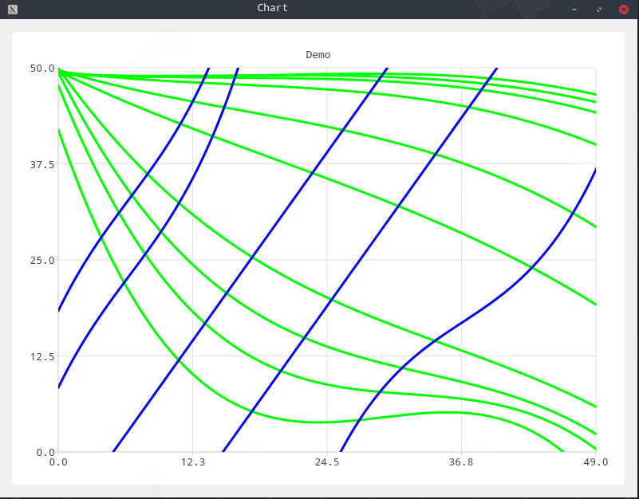

# README

简单的用c++进行的电磁场计算的例子。涉及到的算法有：电磁场的有限差分算法，超松弛迭代算法，三次方程的线性回归算法。其中有限差分算法和超松弛迭代算法用于场内电势的计算，有场内电势可以计算出电场。三次方程的线性回归算法用于进行离散点的曲线匹配。这里用到的算法仅适用于分布简单的电场，复杂电场的等势面较为复杂，使用简单的三次曲线根本无法匹配，要用到更为高级的曲线匹配算法。经过对比，使用c++对电场的计算要比matlab要快上很多。结果如下：

